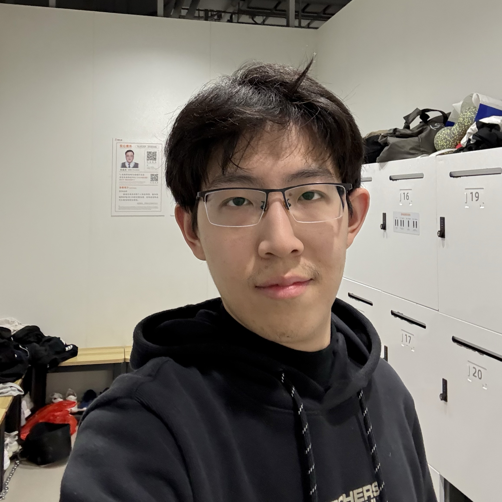
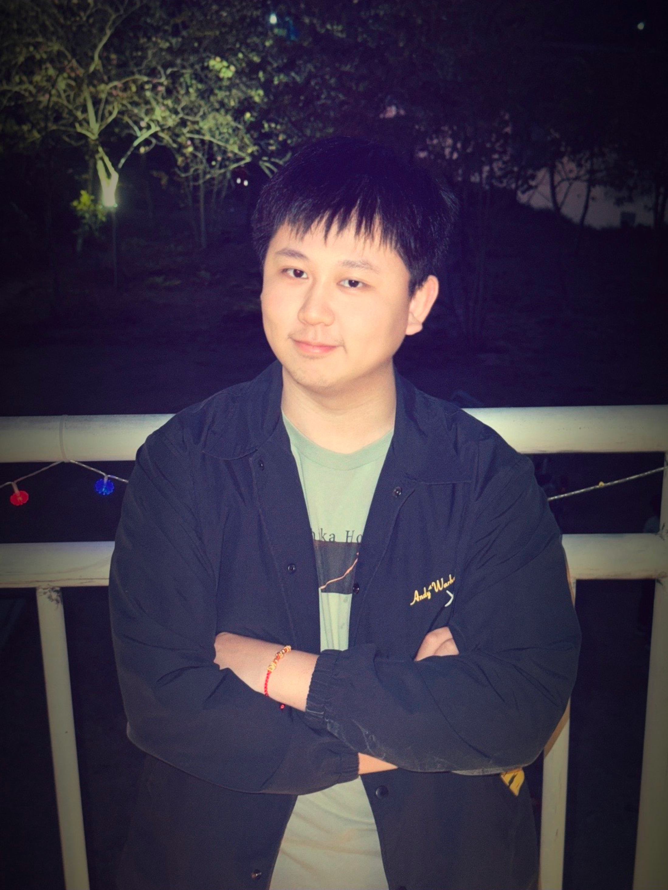

<!-- 通用样式定义 -->

## Principal Investigator

  

    
    

      <h3 class="profile-name">Huan Wang</h3>

      

        <a href="https://huanwang.tech/" title="Homepage"><i class="fa-solid fa-house"></i></a>
        <a href="mailto:wanghuan@westlake.edu.cn" title="email"><i class="fa-solid fa-envelope"></i></a>
        <a href="https://scholar.google.com/citations?user=0-On0y4AAAAJ&hl=en" title="Google Scholar"><i class="ai ai-google-scholar"></i></a>
        <a href="https://github.com/mingsun-tse" title="GitHub"><i class="fa-brands fa-github"></i></a>
        <a href="https://www.linkedin.com/in/huanwangx" title="LinkedIn"><i class="fa-brands fa-linkedin"></i></a>
        <a href="https://twitter.com/huanwangx" title="X"><i class="fa-brands fa-x-twitter"></i></a>
      

      
Assistant Professor   PhD@NEU, MS&BS@ZJU

    

  

## Administrative & Postdoc Staff

  

    
    

      <h3 class="profile-name">Xinjun Lin</h3>

      

      <a href="mailto:linxinjun@westlake.edu.cn" title="email"><i class="fa-solid fa-envelope"></i></a>
    

    
Administrative Assistant   MFA@Goldsmiths, BA@CAA

    

  

  

    
    

      <h3 class="profile-name">Ying Li</h3>

      

      <a href="https://neuraliying.github.io/" title="Homepage"><i class="fa-solid fa-house"></i></a>
      <a href="mailto:liying06@westlake.edu.cn" title="email"><i class="fa-solid fa-envelope"></i></a>
      <a href="https://scholar.google.com/citations?user=jIkHgFAAAAAJ&hl" title="Google Scholar"><i class="ai ai-google-scholar"></i></a>
    

    
Postdoc Researcher   PhD@SJTU, Since Jan 2025

    

  

  

    
    

      <h3 class="profile-name">Simin Xu</h3>

      

      <a href="https://simmy-x.github.io/" title="Homepage"><i class="fa-solid fa-house"></i></a>
      <a href="mailto:xusimin@westlake.edu.cn" title="email"><i class="fa-solid fa-envelope"></i></a>
      <a href="https://scholar.google.com.hk/citations?user=-9lGlGwAAAAJ&hl=zh-CN" title="Google Scholar"><i class="ai ai-google-scholar"></i></a>
      <a href="https://github.com/Simmy-X" title="GitHub"><i class="fa-brands fa-github"></i></a>
    

    
Postdoc Researcher   PhD@SJTU, Since Feb 2025

    

  

## PhD Students

  

    
    

      <h3 class="profile-name">Kele Shao</h3>

      

      <a href="https://cokeshao.github.io/" title="Homepage"><i class="fa-solid fa-house"></i></a>
      <a href="mailto:shaokele@westlake.edu.cn" title="email"><i class="fa-solid fa-envelope"></i></a>
      <a href="https://scholar.google.com/citations?user=f4-ER1kAAAAJ&hl=en" title="Google Scholar"><i class="ai ai-google-scholar"></i></a>
      <a href="https://github.com/cokeshao" title="GitHub"><i class="fa-brands fa-github"></i></a>
    

    
Fall 2025 -   BS@ZJU

    

  

  

    
    

      <h3 class="profile-name">Keda Tao</h3>

      

      <a href="https://kd-tao.github.io" title="Homepage"><i class="fa-solid fa-house"></i></a>
      <a href="mailto:KD.TAO@outlook.com" title="email"><i class="fa-solid fa-envelope"></i></a>
      <a href="https://scholar.google.com/citations?user=ek8xaLUAAAAJ&hl=en" title="Google Scholar"><i class="ai ai-google-scholar"></i></a>
      <a href="https://github.com/KD-TAO" title="GitHub"><i class="fa-brands fa-github"></i></a>
    

    
Fall 2025 -   BS@XDU

    

  

  

    
    

      <h3 class="profile-name">Hesong Wang</h3>

      

      <a href="https://viridisgreen.github.io" title="Homepage"><i class="fa-solid fa-house"></i></a>
      <a href="mailto:viridisgreen27@gmail.com" title="email"><i class="fa-solid fa-envelope"></i></a>
      <a href="https://github.com/viridisGreen" title="GitHub"><i class="fa-brands fa-github"></i></a>
    

    
Fall 2025 -   BS@BUPT

    

  

  

    
    

      <h3 class="profile-name">Mingluo Su</h3>

      

      <a href="https://sunshine-0903.github.io/" title="Homepage"><i class="fa-solid fa-house"></i></a>
      <a href="mailto:mingluosu0903@gmail.com" title="email"><i class="fa-solid fa-envelope"></i></a>
      <a href="https://scholar.google.com.hk/citations?user=OEGnyD8AAAAJ&hl=zh-CN" title="Google Scholar"><i class="ai ai-google-scholar"></i></a>
      <a href="https://github.com/sunshine-0903" title="GitHub"><i class="fa-brands fa-github"></i></a>
    

    
Fall 2026 -   MS@Beihang   BS@NWPU

    

  

  

    
    

      <h3 class="profile-name">Xueyi Chen</h3>

      

      <a href="https://yige24.github.io/" title="Homepage"><i class="fa-solid fa-house"></i></a>
      <a href="mailto:xueyi.chen.2024@gmail.com" title="email"><i class="fa-solid fa-envelope"></i></a>
      <a href="https://scholar.google.com/citations?user=SfLuBt8AAAAJ" title="Google Scholar"><i class="ai ai-google-scholar"></i></a>
      <a href="https://github.com/YIGE24" title="GitHub"><i class="fa-brands fa-github"></i></a>
    

    
Fall 2026 -   MS@CUHK   BS@FZU

    

  

## Research Assistants

  

    
    

      <h3 class="profile-name">Xin Jin</h3>

      

      <a href="https://jinxins.github.io/" title="Homepage"><i class="fa-solid fa-house"></i></a>
      <a href="mailto:jinxin86@westlake.edu.cn" title="email"><i class="fa-solid fa-envelope"></i></a>
      <a href="https://scholar.google.com/citations?user=v3OwxWIAAAAJ&hl=zh-CN" title="Google Scholar"><i class="ai ai-google-scholar"></i></a>
      <a href="https://github.com/JinXins" title="GitHub"><i class="fa-brands fa-github"></i></a>
    

    
MS&BS@CTBU   Since Jun 2025

    

  

  

    
    

      <h3 class="profile-name">Chun Yang</h3>

      

      <a href="https://chuny9743.github.io/" title="Homepage"><i class="fa-solid fa-house"></i></a>
      <a href="mailto:yangchun@westlake.edu.cn" title="email"><i class="fa-solid fa-envelope"></i></a>
      <a href="https://scholar.google.com/citations?hl=zh-CN&user=D_pszsIAAAAJ" title="Google Scholar"><i class="ai ai-google-scholar"></i></a>
      <a href="https://github.com/chuny9743" title="GitHub"><i class="fa-brands fa-github"></i></a>
    

    
BS@BIT   Since Oct 2025

    

  

<ul class="text-list">
  <li><strong>Shikang Zhang</strong></li>
  <li><strong>Jinhao Sheng</strong></li>
</ul>

## Visiting Students

<ul class="text-list">
  <li><strong>Youssef Ahmed</strong> BS@Westlake</li>
  <li><strong><a href="https://deadlykitten4.github.io/">Haolei Bai</a></strong> MS@NTU</li>
  <li><strong>Wenrui Bao</strong> MS@NTU</li>
  <li><strong>Zixu Wang</strong></li>
  <li><strong>Yikai Yang</strong> MS@ZJU</li>
  <li><strong><a href="https://pillor9.github.io/">Yuhua Zheng</a></strong> BS@ZJU</li>
  <li><strong>Wenxi Zhu</strong> BS@Westlake</li>
</ul>

## Alumni

<ul class="text-list">
  <li><strong><a href="https://ai-kunkun.github.io/">Zhenxin Ai</a></strong> BS@JXUST</li>
  <li><strong>Rongfu Bai</strong> BS@XJTU</li>
  <li><strong><a href="https://kurt232.github.io/">Wenjie Du</a></strong> BS@SCU → MS@NTU</li>
  <li><strong><a href="https://fscdc.github.io/">Sicheng Feng</a></strong> BS@NKU → PhD@NUS</li>
  <li><strong><a href="https://syjmelody.github.io/">Siyong Jian</a></strong> MS@NJU</li>
  <li><strong><a href="https://www.linkedin.com/in/lingcheng-kong-443624303">Lingcheng Kong</a></strong> BS@HKUST</li>
  <li><strong><a href="https://hp-l33.github.io/">Haopeng Li</a></strong> BS@BUPT → MS@HKUST(GZ)</li>
  <li><strong><a href="https://boyaliao.github.io/">Boya Liao</a></strong> MS@ZJU → PhD@UMN</li>
  <li><strong><a href="https://ddsacu.github.io/">Zhizhen Pan</a></strong> BS@BUPT</li>
  <li><strong><a href="https://xuan9-9.github.io/">Jiaxuan Ren</a></strong> BS@UESTC</li>
  <li><strong><a href="https://hanzhangshen03.github.io">Hanzhang Shen</a></strong> BS@Cambridge</li>
  <li><strong>Haoyu Shen</strong></li>
  <li><strong><a href="https://zhenyusun-walker.github.io/">Zhenyu Sun</a></strong> BS@SCUT → PhD@SJTU</li>
  <li><strong><a href="https://cfintech.github.io/">Kaiwen Tuo</a></strong> BS@Tongji → PhD@HKUST</li>
  <li><strong><a href="https://aden9460.github.io/Zefang-Wang/">Zefang Wang</a></strong> MS@ZJU</li>
  <li><strong>Qitong Wang</strong></li>
  <li><strong>Fan Wu</strong></li>
  <li><strong><a href="https://xianzuwu.github.io/">Xianzu Wu</a></strong></li>
  <li><strong><a href="https://jiaxu0123.github.io/jiaxu/">Jia Xu</a></strong> BS@BIT</li>
  <li><strong><a href="https://wiserzhou.github.io">Yufan Zhou</a></strong> BS@HIT</li>
  <li><strong><a href="https://alrightlone.github.io/">Junhan Zhu</a></strong> BS@Westlake</li>
  <li><strong><a href="https://wuyulunbizhouojielun.github.io/">Huixing Zhu</a></strong> BS@ZJU → MS@ZJU</li>
</ul>
